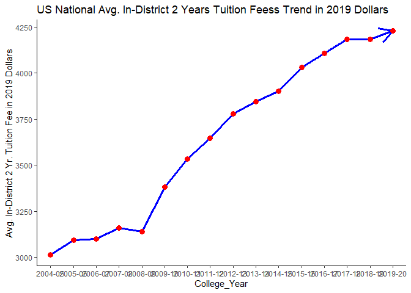
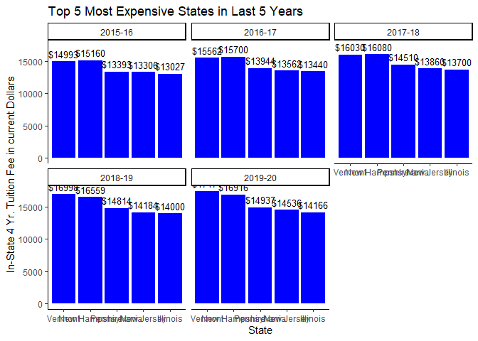

US Tuition Fees at Public Institutions
================

## Data Source and Background

The data was obtained from CollegeBoard. (Source
Link:<https://research.collegeboard.org/trends/college-pricing/resource-library>)
The data is in excel format and contains cost associate with one year of
undergraduate study in the U.S. and how those costs have changed over
time at the following types of institutions, or sectors.

## Data characteristics

The data file contains multiple sheets but for the the purpose of this
project we will pick the sheet named “Table 5” and save it as CSV. This
sheet contains Average Published TuitionFees at Public Institutions by
State ranging from the years 2004-2020.

## Data variables

This data contains:

1.  State Names
2.  Public Two-Year In-District Tuition Fees over a course of one year
    in current dollar rate
3.  Public Two-Year In-District Tuition Fees over a course of one year
    in dollar rate during 2019
4.  Public Four-Year In-State Tuition and Fees over a course of one year
    in current dollar rate
5.  Public Four-Year In-State Tuition and Fees over a course of one year
    in during 2019

More of the data summary can be seen later.

## Loading Data

``` r
collegepricing.df <- read.delim(file="trends-college-pricing-data.csv",header = TRUE, stringsAsFactors = FALSE, sep = ",",skip =2)

knitr::kable(head(collegepricing.df[, 1:10]), "markdown")
```

| In.2019.Dollars | X2004.05 | X2005.06 | X2006.07 | X2007.08 | X2008.09 | X2009.10 | X2010.11 | X2011.12 | X2012.13 |
| :-------------- | :------- | :------- | :------- | :------- | :------- | :------- | :------- | :------- | :------- |
| Alabama         | $3,695   | $3,585   | $3,513   | $3,460   | $3,307   | $3,382   | $4,021   | $4,554   | $4,578   |
| Alaska          | N/A      | N/A      | N/A      | N/A      | N/A      | N/A      | N/A      | N/A      | N/A      |
| Arizona         | $1,887   | $1,998   | $2,093   | $2,077   | $2,124   | $2,285   | $2,329   | $2,443   | $2,468   |
| Arkansas        | $2,539   | $2,600   | $2,641   | $2,633   | $2,678   | $2,833   | $2,972   | $3,024   | $3,129   |
| California      | $1,095   | $1,064   | $913     | $780     | $740     | $973     | $964     | $1,271   | $1,589   |
| Colorado        | $3,005   | $3,136   | $2,996   | $3,029   | $2,974   | $3,298   | $3,674   | $3,854   | $4,006   |

## Why is this data untidy?

``` r
knitr::kable(head(collegepricing.df[, 1:10]), "markdown")
```

| In.2019.Dollars | X2004.05 | X2005.06 | X2006.07 | X2007.08 | X2008.09 | X2009.10 | X2010.11 | X2011.12 | X2012.13 |
| :-------------- | :------- | :------- | :------- | :------- | :------- | :------- | :------- | :------- | :------- |
| Alabama         | $3,695   | $3,585   | $3,513   | $3,460   | $3,307   | $3,382   | $4,021   | $4,554   | $4,578   |
| Alaska          | N/A      | N/A      | N/A      | N/A      | N/A      | N/A      | N/A      | N/A      | N/A      |
| Arizona         | $1,887   | $1,998   | $2,093   | $2,077   | $2,124   | $2,285   | $2,329   | $2,443   | $2,468   |
| Arkansas        | $2,539   | $2,600   | $2,641   | $2,633   | $2,678   | $2,833   | $2,972   | $3,024   | $3,129   |
| California      | $1,095   | $1,064   | $913     | $780     | $740     | $973     | $964     | $1,271   | $1,589   |
| Colorado        | $3,005   | $3,136   | $2,996   | $3,029   | $2,974   | $3,298   | $3,674   | $3,854   | $4,006   |

This data is untidy because it voilates the following principles of tidy
data: Each variable must have its own column. and Each observation must
have its own row.As we can see above the year ranges don’t have one
dedicated column and the prices don’t have their own rows. That is why
we need to clean up this data.

## Data Summary

Data Summary for seeing the type of data i.e. string or numeric

``` r
str(collegepricing.df)
```

    ## 'data.frame':    113 obs. of  38 variables:
    ##  $ In.2019.Dollars   : chr  "Alabama" "Alaska" "Arizona" "Arkansas" ...
    ##  $ X2004.05          : chr  "$3,695" "N/A" "$1,887" "$2,539" ...
    ##  $ X2005.06          : chr  "$3,585" "N/A" "$1,998" "$2,600" ...
    ##  $ X2006.07          : chr  "$3,513" "N/A" "$2,093" "$2,641" ...
    ##  $ X2007.08          : chr  "$3,460" "N/A" "$2,077" "$2,633" ...
    ##  $ X2008.09          : chr  "$3,307" "N/A" "$2,124" "$2,678" ...
    ##  $ X2009.10          : chr  "$3,382" "N/A" "$2,285" "$2,833" ...
    ##  $ X2010.11          : chr  "$4,021" "N/A" "$2,329" "$2,972" ...
    ##  $ X2011.12          : chr  "$4,554" "N/A" "$2,443" "$3,024" ...
    ##  $ X2012.13          : chr  "$4,578" "N/A" "$2,468" "$3,129" ...
    ##  $ X2013.14          : chr  "$4,559" "N/A" "$2,563" "$3,302" ...
    ##  $ X2014.15          : chr  "$4,584" "N/A" "$2,617" "$3,421" ...
    ##  $ X2015.16          : chr  "$4,638" "N/A" "$2,660" "$3,658" ...
    ##  $ X2016.17          : chr  "$4,686" "N/A" "$2,728" "$3,766" ...
    ##  $ X2017.18          : chr  "$4,696" "N/A" "$2,725" "$3,784" ...
    ##  $ X2018.19          : chr  "$4,847" "N/A" "$2,629" "$3,737" ...
    ##  $ X2019.20          : chr  "$4,871" "N/A" "$2,606" "$3,761" ...
    ##  $ X1.Year...Change  : chr  "0%" "N/A" "-1%" "1%" ...
    ##  $ X5.Year...Change  : chr  "6%" "N/A" "0%" "10%" ...
    ##  $ X                 : chr  "" "" "" "" ...
    ##  $ X2004.05.1        : chr  "$6,109" "$4,653" "$5,524" "$6,206" ...
    ##  $ X2005.06.1        : chr  "$6,279" "$4,980" "$5,822" "$6,539" ...
    ##  $ X2006.07.1        : chr  "$6,185" "$5,288" "$5,893" "$6,700" ...
    ##  $ X2007.08.1        : chr  "$6,459" "$5,450" "$6,108" "$6,897" ...
    ##  $ X2008.09.1        : chr  "$6,961" "$5,457" "$6,513" "$6,898" ...
    ##  $ X2009.10.1        : chr  "$7,729" "$5,864" "$7,808" "$7,125" ...
    ##  $ X2010.11.1        : chr  "$8,677" "$6,192" "$9,503" "$7,419" ...
    ##  $ X2011.12.1        : chr  "$9,086" "$6,195" "$10,715" "$7,557" ...
    ##  $ X2012.13.1        : chr  "$9,781" "$6,479" "$10,894" "$7,834" ...
    ##  $ X2013.14.1        : chr  "$10,062" "$6,464" "$11,069" "$7,965" ...
    ##  $ X2014.15.1        : chr  "$10,209" "$6,610" "$11,196" "$8,177" ...
    ##  $ X2015.16.1        : chr  "$10,477" "$7,207" "$11,432" "$8,474" ...
    ##  $ X2016.17.1        : chr  "$10,750" "$7,599" "$11,654" "$8,800" ...
    ##  $ X2017.18.1        : chr  "$11,163" "$7,798" "$11,750" "$8,962" ...
    ##  $ X2018.19.1        : chr  "$10,972" "$7,962" "$11,754" "$8,859" ...
    ##  $ X2019.20.1        : chr  "$10,918" "$8,233" "$11,921" "$9,033" ...
    ##  $ X1.Year...Change.1: chr  "0%" "3%" "1%" "2%" ...
    ##  $ X5.Year...Change.1: chr  "7%" "25%" "6%" "10%" ...

Summary for seeing various factors like mean:

``` r
summary(collegepricing.df)
```

    ##  In.2019.Dollars      X2004.05           X2005.06           X2006.07        
    ##  Length:113         Length:113         Length:113         Length:113        
    ##  Class :character   Class :character   Class :character   Class :character  
    ##  Mode  :character   Mode  :character   Mode  :character   Mode  :character  
    ##    X2007.08           X2008.09           X2009.10           X2010.11        
    ##  Length:113         Length:113         Length:113         Length:113        
    ##  Class :character   Class :character   Class :character   Class :character  
    ##  Mode  :character   Mode  :character   Mode  :character   Mode  :character  
    ##    X2011.12           X2012.13           X2013.14           X2014.15        
    ##  Length:113         Length:113         Length:113         Length:113        
    ##  Class :character   Class :character   Class :character   Class :character  
    ##  Mode  :character   Mode  :character   Mode  :character   Mode  :character  
    ##    X2015.16           X2016.17           X2017.18           X2018.19        
    ##  Length:113         Length:113         Length:113         Length:113        
    ##  Class :character   Class :character   Class :character   Class :character  
    ##  Mode  :character   Mode  :character   Mode  :character   Mode  :character  
    ##    X2019.20         X1.Year...Change   X5.Year...Change        X            
    ##  Length:113         Length:113         Length:113         Length:113        
    ##  Class :character   Class :character   Class :character   Class :character  
    ##  Mode  :character   Mode  :character   Mode  :character   Mode  :character  
    ##   X2004.05.1         X2005.06.1         X2006.07.1         X2007.08.1       
    ##  Length:113         Length:113         Length:113         Length:113        
    ##  Class :character   Class :character   Class :character   Class :character  
    ##  Mode  :character   Mode  :character   Mode  :character   Mode  :character  
    ##   X2008.09.1         X2009.10.1         X2010.11.1         X2011.12.1       
    ##  Length:113         Length:113         Length:113         Length:113        
    ##  Class :character   Class :character   Class :character   Class :character  
    ##  Mode  :character   Mode  :character   Mode  :character   Mode  :character  
    ##   X2012.13.1         X2013.14.1         X2014.15.1         X2015.16.1       
    ##  Length:113         Length:113         Length:113         Length:113        
    ##  Class :character   Class :character   Class :character   Class :character  
    ##  Mode  :character   Mode  :character   Mode  :character   Mode  :character  
    ##   X2016.17.1         X2017.18.1         X2018.19.1         X2019.20.1       
    ##  Length:113         Length:113         Length:113         Length:113        
    ##  Class :character   Class :character   Class :character   Class :character  
    ##  Mode  :character   Mode  :character   Mode  :character   Mode  :character  
    ##  X1.Year...Change.1 X5.Year...Change.1
    ##  Length:113         Length:113        
    ##  Class :character   Class :character  
    ##  Mode  :character   Mode  :character

## Data cleaning using Tidyr

1.  Changing column names and removing unecessary columns

<!-- end list -->

``` r
#install.packages("tidyverse")
library(tidyverse)
collegepricing.df <- collegepricing.df %>% select(-X,-contains("Change"))
collegepricing.df <-collegepricing.df %>% rename(State = In.2019.Dollars)
knitr::kable(head(collegepricing.df[, 1:10]), "markdown")
```

| State      | X2004.05 | X2005.06 | X2006.07 | X2007.08 | X2008.09 | X2009.10 | X2010.11 | X2011.12 | X2012.13 |
| :--------- | :------- | :------- | :------- | :------- | :------- | :------- | :------- | :------- | :------- |
| Alabama    | $3,695   | $3,585   | $3,513   | $3,460   | $3,307   | $3,382   | $4,021   | $4,554   | $4,578   |
| Alaska     | N/A      | N/A      | N/A      | N/A      | N/A      | N/A      | N/A      | N/A      | N/A      |
| Arizona    | $1,887   | $1,998   | $2,093   | $2,077   | $2,124   | $2,285   | $2,329   | $2,443   | $2,468   |
| Arkansas   | $2,539   | $2,600   | $2,641   | $2,633   | $2,678   | $2,833   | $2,972   | $3,024   | $3,129   |
| California | $1,095   | $1,064   | $913     | $780     | $740     | $973     | $964     | $1,271   | $1,589   |
| Colorado   | $3,005   | $3,136   | $2,996   | $3,029   | $2,974   | $3,298   | $3,674   | $3,854   | $4,006   |

2.  Splitting data based on Dollar Values and Distric and State

<!-- end list -->

``` r
dollars2019.df <- collegepricing.df[1:52,]
dollarscurrent.df <- collegepricing.df[55:106,]

dollars2019.district.df <- dollars2019.df %>% select(State, 2:17)
dollars2019.state.df <- dollars2019.df %>% select(State, 18:33)


dollarscurrent.district.df <- dollarscurrent.df %>% select(State, 2:17)
dollarscurrent.state.df <- dollarscurrent.df %>% select(State, 18:33)

knitr::kable(head(dollars2019.state.df[, 1:15]), "markdown")
```

| State      | X2004.05.1 | X2005.06.1 | X2006.07.1 | X2007.08.1 | X2008.09.1 | X2009.10.1 | X2010.11.1 | X2011.12.1 | X2012.13.1 | X2013.14.1 | X2014.15.1 | X2015.16.1 | X2016.17.1 | X2017.18.1 |
| :--------- | :--------- | :--------- | :--------- | :--------- | :--------- | :--------- | :--------- | :--------- | :--------- | :--------- | :--------- | :--------- | :--------- | :--------- |
| Alabama    | $6,109     | $6,279     | $6,185     | $6,459     | $6,961     | $7,729     | $8,677     | $9,086     | $9,781     | $10,062    | $10,209    | $10,477    | $10,750    | $11,163    |
| Alaska     | $4,653     | $4,980     | $5,288     | $5,450     | $5,457     | $5,864     | $6,192     | $6,195     | $6,479     | $6,464     | $6,610     | $7,207     | $7,599     | $7,798     |
| Arizona    | $5,524     | $5,822     | $5,893     | $6,108     | $6,513     | $7,808     | $9,503     | $10,715    | $10,894    | $11,069    | $11,196    | $11,432    | $11,654    | $11,750    |
| Arkansas   | $6,206     | $6,539     | $6,700     | $6,897     | $6,898     | $7,125     | $7,419     | $7,557     | $7,834     | $7,965     | $8,177     | $8,474     | $8,800     | $8,962     |
| California | $5,683     | $5,943     | $5,735     | $6,098     | $6,341     | $7,804     | $8,809     | $10,145    | $10,063    | $9,970     | $9,877     | $9,963     | $9,918     | $10,272    |
| Colorado   | $5,057     | $5,813     | $6,016     | $6,695     | $6,756     | $7,470     | $8,330     | $8,940     | $9,453     | $9,991     | $9,997     | $10,480    | $10,967    | $11,330    |

3.  Gathering Data by college years

<!-- end list -->

``` r
dollars2019.district.df <- dollars2019.district.df %>% gather(key = 'College_Year', value = "In-District 2 Yr. Tuition Fee in 2019 Dollars",-State)
dollars2019.state.df <- dollars2019.state.df %>% gather(key = 'College_Year', value = "In-State 4 Yr. Tuition Fee in 2019 Dollars", -State)


dollarscurrent.district.df  <- dollarscurrent.district.df  %>% gather(key = 'College_Year', value = "In-District 2 Yr. Tuition Fee in current Dollars",-State)
dollarscurrent.state.df <- dollarscurrent.state.df %>% gather(key = 'College_Year', value = "In-State 4 Yr. Tuition Fee in current Dollars", -State)
knitr::kable(head(dollars2019.state.df), "markdown")
```

| State      | College\_Year | In-State 4 Yr. Tuition Fee in 2019 Dollars |
| :--------- | :------------ | :----------------------------------------- |
| Alabama    | X2004.05.1    | $6,109                                     |
| Alaska     | X2004.05.1    | $4,653                                     |
| Arizona    | X2004.05.1    | $5,524                                     |
| Arkansas   | X2004.05.1    | $6,206                                     |
| California | X2004.05.1    | $5,683                                     |
| Colorado   | X2004.05.1    | $5,057                                     |

4.  Cleaning column names
    
    \+Cleaning column names for Tables with DOllar value of 2019 TUtion
    Fee

<!-- end list -->

``` r
dollars2019.district.df$College_Year <- str_replace_all(dollars2019.district.df$College_Year,"X","")
dollars2019.district.df$College_Year <- str_trim(str_replace_all(dollars2019.district.df$College_Year,"\\.","-"))

dollars2019.state.df$College_Year <- str_replace_all(dollars2019.state.df$College_Year,"X","")
dollars2019.state.df$College_Year <- str_trim(str_replace_all(dollars2019.state.df$College_Year,"\\.","-"))
dollars2019.state.df$College_Year <- str_trim(str_replace_all(dollars2019.state.df$College_Year,"-05-1","-05"))
dollars2019.state.df$College_Year <- str_trim(str_replace_all(dollars2019.state.df$College_Year,"-06-1","-06"))
dollars2019.state.df$College_Year <- str_trim(str_replace_all(dollars2019.state.df$College_Year,"-07-1","-07"))
dollars2019.state.df$College_Year <- str_trim(str_replace_all(dollars2019.state.df$College_Year,"-08-1","-08"))
dollars2019.state.df$College_Year <- str_trim(str_replace_all(dollars2019.state.df$College_Year,"-09-1","-09"))
dollars2019.state.df$College_Year <- str_trim(str_replace_all(dollars2019.state.df$College_Year,"-10-1","-10"))
dollars2019.state.df$College_Year <- str_trim(str_replace_all(dollars2019.state.df$College_Year,"-11-1","-11"))
dollars2019.state.df$College_Year <- str_trim(str_replace_all(dollars2019.state.df$College_Year,"-12-1","-12"))
dollars2019.state.df$College_Year <- str_trim(str_replace_all(dollars2019.state.df$College_Year,"-13-1","-13"))
dollars2019.state.df$College_Year <- str_trim(str_replace_all(dollars2019.state.df$College_Year,"-14-1","-14"))
dollars2019.state.df$College_Year <- str_trim(str_replace_all(dollars2019.state.df$College_Year,"-15-1","-15"))
dollars2019.state.df$College_Year <- str_trim(str_replace_all(dollars2019.state.df$College_Year,"-16-1","-16"))
dollars2019.state.df$College_Year <- str_trim(str_replace_all(dollars2019.state.df$College_Year,"-17-1","-17"))
dollars2019.state.df$College_Year <- str_trim(str_replace_all(dollars2019.state.df$College_Year,"-18-1","-18"))
dollars2019.state.df$College_Year <- str_trim(str_replace_all(dollars2019.state.df$College_Year,"-19-1","-19"))
dollars2019.state.df$College_Year <- str_trim(str_replace_all(dollars2019.state.df$College_Year,"-20-1","-20"))


knitr::kable(head(dollars2019.state.df), "markdown")
```

| State      | College\_Year | In-State 4 Yr. Tuition Fee in 2019 Dollars |
| :--------- | :------------ | :----------------------------------------- |
| Alabama    | 2004-05       | $6,109                                     |
| Alaska     | 2004-05       | $4,653                                     |
| Arizona    | 2004-05       | $5,524                                     |
| Arkansas   | 2004-05       | $6,206                                     |
| California | 2004-05       | $5,683                                     |
| Colorado   | 2004-05       | $5,057                                     |

``` 
  +Cleaning column names for Tables with Current Dollar Value TUtion Fee
  
```

``` r
dollarscurrent.district.df$College_Year <- str_replace_all(dollarscurrent.district.df$College_Year,"X","")
dollarscurrent.district.df$College_Year <- str_trim(str_replace_all(dollarscurrent.district.df$College_Year,"\\.","-"))


dollarscurrent.state.df$College_Year <- str_replace_all(dollarscurrent.state.df$College_Year,"X","")
dollarscurrent.state.df$College_Year <- str_trim(str_replace_all(dollarscurrent.state.df$College_Year,"\\.","-"))
dollarscurrent.state.df$College_Year <- str_trim(str_replace_all(dollarscurrent.state.df$College_Year,"-05-1","-05"))
dollarscurrent.state.df$College_Year <- str_trim(str_replace_all(dollarscurrent.state.df$College_Year,"-06-1","-06"))
dollarscurrent.state.df$College_Year <- str_trim(str_replace_all(dollarscurrent.state.df$College_Year,"-07-1","-07"))
dollarscurrent.state.df$College_Year <- str_trim(str_replace_all(dollarscurrent.state.df$College_Year,"-08-1","-08"))
dollarscurrent.state.df$College_Year <- str_trim(str_replace_all(dollarscurrent.state.df$College_Year,"-09-1","-09"))
dollarscurrent.state.df$College_Year <- str_trim(str_replace_all(dollarscurrent.state.df$College_Year,"-10-1","-10"))
dollarscurrent.state.df$College_Year <- str_trim(str_replace_all(dollarscurrent.state.df$College_Year,"-11-1","-11"))
dollarscurrent.state.df$College_Year <- str_trim(str_replace_all(dollarscurrent.state.df$College_Year,"-12-1","-12"))
dollarscurrent.state.df$College_Year <- str_trim(str_replace_all(dollarscurrent.state.df$College_Year,"-13-1","-13"))
dollarscurrent.state.df$College_Year <- str_trim(str_replace_all(dollarscurrent.state.df$College_Year,"-14-1","-14"))
dollarscurrent.state.df$College_Year <- str_trim(str_replace_all(dollarscurrent.state.df$College_Year,"-15-1","-15"))
dollarscurrent.state.df$College_Year <- str_trim(str_replace_all(dollarscurrent.state.df$College_Year,"-16-1","-16"))
dollarscurrent.state.df$College_Year <- str_trim(str_replace_all(dollarscurrent.state.df$College_Year,"-17-1","-17"))
dollarscurrent.state.df$College_Year <- str_trim(str_replace_all(dollarscurrent.state.df$College_Year,"-18-1","-18"))
dollarscurrent.state.df$College_Year <- str_trim(str_replace_all(dollarscurrent.state.df$College_Year,"-19-1","-19"))
dollarscurrent.state.df$College_Year <- str_trim(str_replace_all(dollarscurrent.state.df$College_Year,"-20-1","-20"))

knitr::kable(head(dollarscurrent.state.df), "markdown")
```

| State      | College\_Year | In-State 4 Yr. Tuition Fee in current Dollars |
| :--------- | :------------ | :-------------------------------------------- |
| Alabama    | 2004-05       | $4,510                                        |
| Alaska     | 2004-05       | $3,435                                        |
| Arizona    | 2004-05       | $4,078                                        |
| Arkansas   | 2004-05       | $4,581                                        |
| California | 2004-05       | $4,195                                        |
| Colorado   | 2004-05       | $3,733                                        |

5.  Combing the data and converting the data type for the Fees

<!-- end list -->

``` r
dollars2019DF <- inner_join(dollars2019.district.df,dollars2019.state.df)

dollars2019DF$`In-District 2 Yr. Tuition Fee in 2019 Dollars` <- as.numeric(str_trim(str_replace_all(str_replace_all(dollars2019DF$`In-District 2 Yr. Tuition Fee in 2019 Dollars`,"N/A","$0"),"\\$|,","")))
dollars2019DF$`In-State 4 Yr. Tuition Fee in 2019 Dollars` <- as.numeric(str_trim(str_replace_all(str_replace_all(dollars2019DF$`In-State 4 Yr. Tuition Fee in 2019 Dollars`,"N/A","$0"),"\\$|,","")))

dollarscurrentDF <- inner_join(dollarscurrent.district.df,dollarscurrent.state.df)
dollarscurrentDF$`In-District 2 Yr. Tuition Fee in current Dollars` <- as.numeric(str_trim(str_replace_all(str_replace_all(dollarscurrentDF$`In-District 2 Yr. Tuition Fee in current Dollars`,"N/A","$0"),"\\$|,","")))
dollarscurrentDF$`In-State 4 Yr. Tuition Fee in current Dollars` <- as.numeric(str_trim(str_replace_all(str_replace_all(dollarscurrentDF$`In-State 4 Yr. Tuition Fee in current Dollars`,"N/A","$0"),"\\$|,","")))


maindf<-inner_join(dollars2019DF,dollarscurrentDF)
knitr::kable(head(maindf), "markdown")
```

| State      | College\_Year | In-District 2 Yr. Tuition Fee in 2019 Dollars | In-State 4 Yr. Tuition Fee in 2019 Dollars | In-District 2 Yr. Tuition Fee in current Dollars | In-State 4 Yr. Tuition Fee in current Dollars |
| :--------- | :------------ | --------------------------------------------: | -----------------------------------------: | -----------------------------------------------: | --------------------------------------------: |
| Alabama    | 2004-05       |                                          3695 |                                       6109 |                                             2728 |                                          4510 |
| Alaska     | 2004-05       |                                             0 |                                       4653 |                                                0 |                                          3435 |
| Arizona    | 2004-05       |                                          1887 |                                       5524 |                                             1393 |                                          4078 |
| Arkansas   | 2004-05       |                                          2539 |                                       6206 |                                             1874 |                                          4581 |
| California | 2004-05       |                                          1095 |                                       5683 |                                              808 |                                          4195 |
| Colorado   | 2004-05       |                                          3005 |                                       5057 |                                             2218 |                                          3733 |

## Tidy Data

1.  Untidy Data

<!-- end list -->

``` r
knitr::kable(head(collegepricing.df[, 1:10]), "markdown")
```

| State      | X2004.05 | X2005.06 | X2006.07 | X2007.08 | X2008.09 | X2009.10 | X2010.11 | X2011.12 | X2012.13 |
| :--------- | :------- | :------- | :------- | :------- | :------- | :------- | :------- | :------- | :------- |
| Alabama    | $3,695   | $3,585   | $3,513   | $3,460   | $3,307   | $3,382   | $4,021   | $4,554   | $4,578   |
| Alaska     | N/A      | N/A      | N/A      | N/A      | N/A      | N/A      | N/A      | N/A      | N/A      |
| Arizona    | $1,887   | $1,998   | $2,093   | $2,077   | $2,124   | $2,285   | $2,329   | $2,443   | $2,468   |
| Arkansas   | $2,539   | $2,600   | $2,641   | $2,633   | $2,678   | $2,833   | $2,972   | $3,024   | $3,129   |
| California | $1,095   | $1,064   | $913     | $780     | $740     | $973     | $964     | $1,271   | $1,589   |
| Colorado   | $3,005   | $3,136   | $2,996   | $3,029   | $2,974   | $3,298   | $3,674   | $3,854   | $4,006   |

2.Tidy Data

``` r
knitr::kable(head(maindf), "markdown")
```

| State      | College\_Year | In-District 2 Yr. Tuition Fee in 2019 Dollars | In-State 4 Yr. Tuition Fee in 2019 Dollars | In-District 2 Yr. Tuition Fee in current Dollars | In-State 4 Yr. Tuition Fee in current Dollars |
| :--------- | :------------ | --------------------------------------------: | -----------------------------------------: | -----------------------------------------------: | --------------------------------------------: |
| Alabama    | 2004-05       |                                          3695 |                                       6109 |                                             2728 |                                          4510 |
| Alaska     | 2004-05       |                                             0 |                                       4653 |                                                0 |                                          3435 |
| Arizona    | 2004-05       |                                          1887 |                                       5524 |                                             1393 |                                          4078 |
| Arkansas   | 2004-05       |                                          2539 |                                       6206 |                                             1874 |                                          4581 |
| California | 2004-05       |                                          1095 |                                       5683 |                                              808 |                                          4195 |
| Colorado   | 2004-05       |                                          3005 |                                       5057 |                                             2218 |                                          3733 |

We can see the difference by comparing the two tables. The untidy data
didn’t have columns for years. But now by gathering the data we have
made columns for each year period. Additionally, the untidy data didn’t
have individual observations for the prices. By making separate columns
for the prices the data is now tidy.

## Data Visualization

1.  USA National Average In-District 2 Years Tuition Feess(Dollar
    rate=2019)

<!-- end list -->

``` r
nationalavg2019 <- maindf %>% group_by(College_Year) %>% summarize(`Avg. In-District 2 Yr. Tuition Fee in 2019 Dollars` = mean(`In-District 2 Yr. Tuition Fee in 2019 Dollars`),`Avg. In-State 4 Yr. Tuition Fee in 2019 Dollars` = mean(`In-State 4 Yr. Tuition Fee in 2019 Dollars`))

theme_set(theme_classic())

ggplot(data=nationalavg2019, aes(x=College_Year,y=`Avg. In-District 2 Yr. Tuition Fee in 2019 Dollars`, group=1)) +
  geom_line(arrow = arrow(), color = "blue",size = 1.2)+
  geom_point(color = "red", size = 3)+
  #theme(axis.text.x=element_text(angle = 45, vjust = 0.5)) +
  scale_fill_brewer(palette="Paired") + 
  ggtitle("US National Avg. In-District 2 Years Tuition Feess Trend in 2019 Dollars") 
```

<!-- -->

##### Pattern Observed:

The graph above allows to see the overall trend of tution fees for
pulbic two year in-district colleges. The graph above shows a steep rise
in tuiton fees of colleges from the year 2008-09.

``` r
lastfiveyears <- maindf %>% select(State, College_Year,`In-State 4 Yr. Tuition Fee in current Dollars`) %>%
                          filter(College_Year >= "2015-16") %>%  group_by(College_Year,State) %>% 
                          summarise(`In-State 4 Yr. Tuition Fee in current Dollars`= sum(`In-State 4 Yr. Tuition Fee in current Dollars`)) %>% 
                          arrange(College_Year,-`In-State 4 Yr. Tuition Fee in current Dollars`) %>% 
                          mutate(rank = row_number()) %>% filter(rank<=5)

theme_set(theme_classic())

ggplot(lastfiveyears, aes(x = reorder(State,-`In-State 4 Yr. Tuition Fee in current Dollars`), y = `In-State 4 Yr. Tuition Fee in current Dollars`)) + 
  geom_bar(stat = "identity",fill="blue") + 
  geom_text(aes(label=paste0("$",round(`In-State 4 Yr. Tuition Fee in current Dollars`,0))), vjust=-0.5, color="black", position = position_dodge(0.9), size=3.5) +
  scale_fill_brewer(palette="Paired") + 
  ggtitle("Top 5 Most Expensive States in Last 5 Years") +
  xlab("State") +  ylab ("In-State 4 Yr. Tuition Fee in current Dollars") +
  facet_wrap(~College_Year)
```

<!-- -->

##### Pattern Observed:

The above graph shows the top 5 most expensive states for In-State 4 Yr.
education with the current dollar rate for the last five years, . From
the above graph we can see that New Hampshire,Vermont,Pennsylvania,New
Jersey and Illinois are always ranked the most expensive states.
